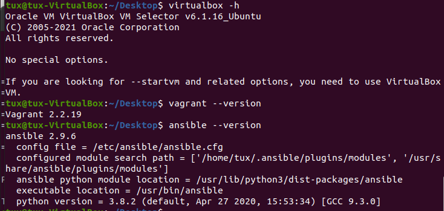
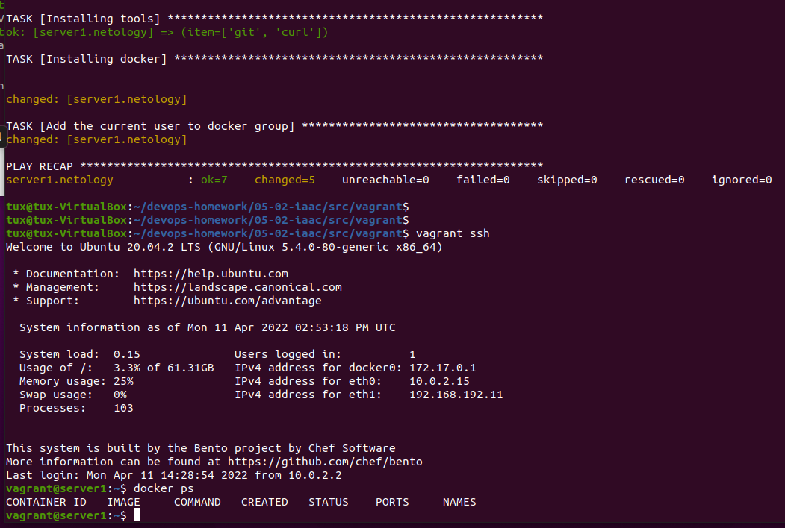

# Домашнее задание к занятию "5.2. Применение принципов IaaC в работе с виртуальными машинами"

## Как сдавать задания

Обязательными к выполнению являются задачи без указания звездочки. Их выполнение необходимо для получения зачета и диплома о профессиональной переподготовке.

Задачи со звездочкой (*) являются дополнительными задачами и/или задачами повышенной сложности. Они не являются обязательными к выполнению, но помогут вам глубже понять тему.

Домашнее задание выполните в файле readme.md в github репозитории. В личном кабинете отправьте на проверку ссылку на .md-файл в вашем репозитории.

Любые вопросы по решению задач задавайте в чате учебной группы.

---

## Задача 1

- Опишите своими словами основные преимущества применения на практике IaaC паттернов.
- Какой из принципов IaaC является основополагающим?
  
### Ответ
-  Преимущества CI - снятие рутинных задач по сливанию кода, дисциплинирование разработчиков по своевременному внесения изменений в репозитарий, прозрачность изменений вносимых разработчиками, контроль и унификация разработки, простота включения в разработку новых участников
-  Преимущества CD(elivery) - решение рутинных задач, по доставке продукта на множестве серверов или клиентов, быстрое внесение критических исправлений и доставка их к клиенту, что позволит снизить число ошибок и поддерживать актуальность
-  Преимущества CD(eployment) - основное преимущество возможность сокращения технического штата у клиента, поскольку весь цикл замыкается на разработчика, гарантия поддержания текущей версии в актуальном состоянии, автоматизированный откат в случае проблем
-  основополагающий принцип - идемпотентность, а если проще - это максимальная воспроизводимость результата в самых разнообразных условиях. С помощью IaaC гарантируем разработку и работу ПО в идентичном окружении, где бы оно (окружение) не находилось

## Задача 2

- Чем Ansible выгодно отличается от других систем управление конфигурациями? 
    
    __ответ:__ организация защищенной связи на основе традиционного SSH, а не сторонних механизмов с использованием ключей, поддержка которых будет уже

- Какой, на ваш взгляд, метод работы систем конфигурации более надёжный push или pull?

   __ответ:__ зависит от условий конкретного предприятия. Если предприятие само разрабатывает и использует ПО, то все равно. Если компания разработчик - то для нее предпочтительней push, для клиентов(эксплуатации/поддержки) удобнее pull. Выбор будет определяться не только удобством, но и распределением полномочий - то есть кто будет отвечать за проблемы возникшие при разворачивании. Кроме того на выбор будут влиять и личные предпочтения персонала.

## Задача 3

Установить на личный компьютер:

- VirtualBox
- Vagrant
- Ansible

__ответ:__ 
В качестве хоста используется VirtualBox  c ubuntu 20.04  
```bash
tux@tux-VirtualBox:~/Desktop$ virtualbox -h
Oracle VM VirtualBox VM Selector v6.1.16_Ubuntu
(C) 2005-2021 Oracle Corporation
All rights reserved.

No special options.

If you are looking for --startvm and related options, you need to use VirtualBoxVM.
tux@tux-VirtualBox:~/Desktop$ vagrant --version
Vagrant 2.2.19
tux@tux-VirtualBox:~/Desktop$ ansible --version
ansible 2.9.6
  config file = /etc/ansible/ansible.cfg
  configured module search path = ['/home/tux/.ansible/plugins/modules', '/usr/share/ansible/plugins/modules']
  ansible python module location = /usr/lib/python3/dist-packages/ansible
  executable location = /usr/bin/ansible
  python version = 3.8.2 (default, Apr 27 2020, 15:53:34) [GCC 9.3.0]

```


## Задача 4 (*)

Воспроизвести практическую часть лекции самостоятельно.
- Создать виртуальную машину.
- Зайти внутрь ВМ, убедиться, что Docker установлен с помощью команды
```
docker ps
```
__ответ:__  использовал Vagrant из папки src. Почему-то Docker ставится очень долго, может быть 

