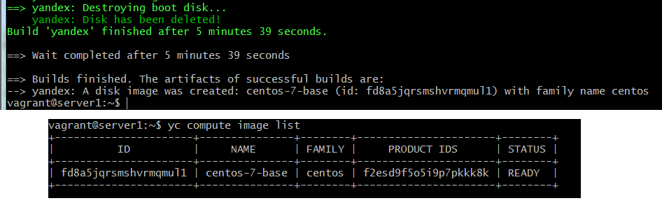
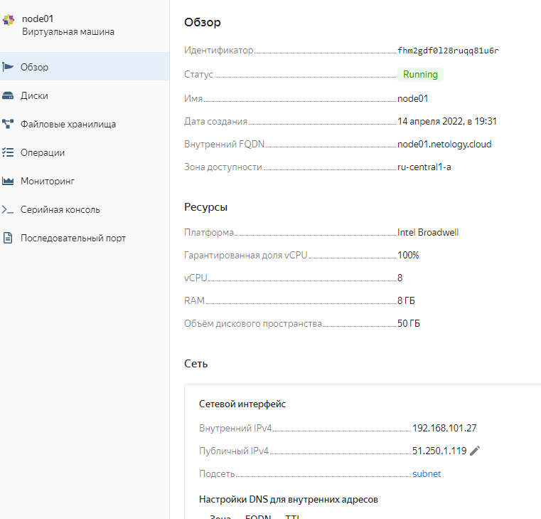
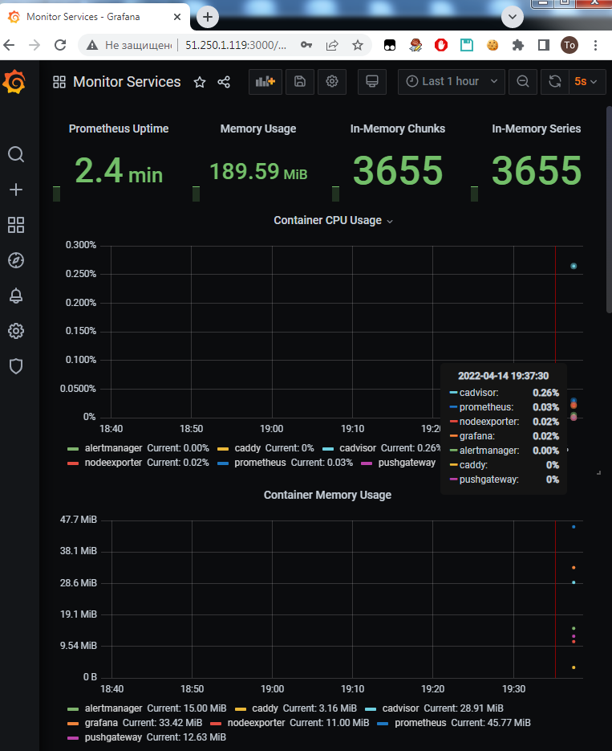
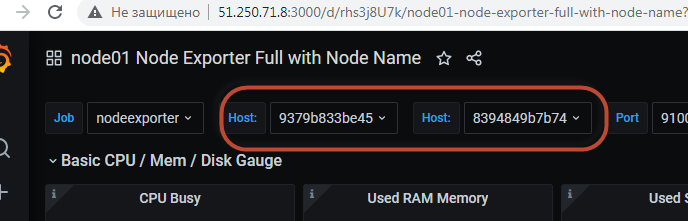

# Домашнее задание к занятию "5.4. Оркестрация группой Docker контейнеров на примере Docker Compose"

---

## Задача 1

Создать собственный образ операционной системы с помощью Packer.

Для получения зачета, вам необходимо предоставить:
- Скриншот страницы, как на слайде из презентации (слайд 37).

## Задача 2

Создать вашу первую виртуальную машину в Яндекс.Облаке.

Для получения зачета, вам необходимо предоставить:
- Скриншот страницы свойств созданной ВМ, как на примере ниже:

## Задача 3

Создать ваш первый готовый к боевой эксплуатации компонент мониторинга, состоящий из стека микросервисов.

Для получения зачета, вам необходимо предоставить:
- Скриншот работающего веб-интерфейса Grafana с текущими метриками, как на примере ниже

## Задача 4 (*)

Создать вторую ВМ и подключить её к мониторингу развёрнутому на первом сервере.

Для получения зачета, вам необходимо предоставить:
- Скриншот из Grafana, на котором будут отображаться метрики добавленного вами сервера.

__ответ__  для создания использовал готовый образ, но терраформ запускал из отдельной папки, из которой удалил файл  network.tf, везде заменил node01 на node02 + в файле node02.tf вставил явно  id подсети, которая была сделана в рамках задач 1-3 

Не очень понятно как корректно подключить в grafana второй хост , в итоге добавил источник данных вида типа prometheus  \<ip node2\>:9090 + нашел какой-то готовый  dashboard, который выводит id хоста . В настройках источника данных тип доступа вко второму хосту "browser"

