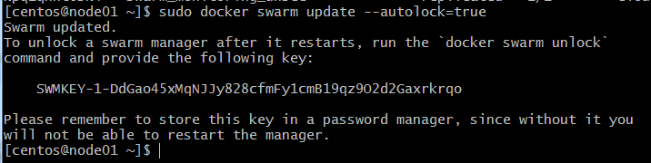

# Домашнее задание к занятию "5.5. Оркестрация кластером Docker контейнеров на примере Docker Swarm"

---

## Задача 1

Дайте письменные ответы на следующие вопросы:

- В чём отличие режимов работы сервисов в Docker Swarm кластере: replication и global?

__ответ__: 
 
 replication - запуск идентичных задач на нужном количестве узлов, то есть при обращении к любому из узлов с сервисом в режиме replication результат должен быть одинаковым. В таком режиме запускаются пользовательские приложения
 
 global - запуск одной и той же задачи независимо на каждом узле, как правило это служебные сервисы, которые нужны для работы с конкретным узлом

- Какой алгоритм выбора лидера используется в Docker Swarm кластере?

__ответ__:   Raft Consensus Algorithm - в начальный момент все узлы кандидаты, на каждом запускается таймер со случайным значением, и тот у которого он заончился раньше, становится кандидатом с 1 (собственным) голосом и запрашивает голоса у других узлов. На остальных узлах также запущены таймеры и если они не успели проголосовать, то голос отдается за кандидата. Дальше происходит регулярный обмен с лидером, и если он перестал отвечать, то запускается новое голосование.

- Что такое Overlay Network?

__ответ__:  специальная логическая сеть для swarm кластера, разворачиваемая поверх физической сети, при этом не используются напрямую сердства ОС, а только сетевой стек самого докера

## Задача 2

Создать ваш первый Docker Swarm кластер в Яндекс.Облаке

Для получения зачета, вам необходимо предоставить скриншот из терминала (консоли), с выводом команды:
```
docker node ls
```


## Задача 3

Создать ваш первый, готовый к боевой эксплуатации кластер мониторинга, состоящий из стека микросервисов.

Для получения зачета, вам необходимо предоставить скриншот из терминала (консоли), с выводом команды:
```
docker service ls
```


## Задача 4 (*)

Выполнить на лидере Docker Swarm кластера команду (указанную ниже) и дать письменное описание её функционала, что она делает и зачем она нужна:
```
# см.документацию: https://docs.docker.com/engine/swarm/swarm_manager_locking/
docker swarm update --autolock=true

[centos@node01 ~]$ sudo docker swarm update --autolock=true
Swarm updated.
To unlock a swarm manager after it restarts, run the `docker swarm unlock`
command and provide the following key:
    SWMKEY-1-DdGao45xMqNJJy828cfmFy1cmB19qz9O2d2Gaxrkrqo
```
__ответ__:  Если это настройка отключена, то 2 ключа шифрования (для связи между узлами и для хранения логов) сохраняются нешифрованными на диск узла. То есть при несанкционированном доступе есть вероятноси уязвиости. Включение опции дполнительно шифрует эти ключи еще одним, который нужно хранить отдельно, что фактически приводит к блокировки автоматического пуска менджера после рестарта, поскольку у него нет ключей необходимых для связи.




