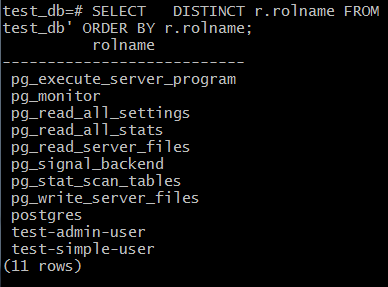

# Домашнее задание к занятию "6.2. SQL"

## Введение

Перед выполнением задания вы можете ознакомиться с 
[дополнительными материалами](https://github.com/netology-code/virt-homeworks/tree/master/additional/README.md).

## Задача 1

Используя docker поднимите инстанс PostgreSQL (версию 12) c 2 volume, 
в который будут складываться данные БД и бэкапы.

Приведите получившуюся команду или docker-compose манифест.
```bash
#забираем официальный образ
sudo docker pull postgres:12
#создаем volume
docker volume create pg_data
docker volume create pg_backup
# запуск контейнера
docker run --rm --name korsh-pg-docker -e POSTGRES_PASSWORD=korsh -v pg_data:/var/lib/postgresql/data -v pg_backup:/var/lib/postgresql/backup -d postgres:12
docker exec -it korsh-pg-docker bash
#следующие команды внутри контейнера, пользователь postgres предустановлен
su postgres
psql
```
## Задача 2

В БД из задачи 1: 
- создайте пользователя test-admin-user и БД test_db
```sql
--находимся в сессии psql
=# CREATE USER "test-admin-user" WITH PASSWORD 'korsh';
=# CREATE DATABASE "test_db";
```
- в БД test_db создайте таблицу orders и clients (спeцификация таблиц ниже)
```sql
--подключаемся  к созданной БД
=# \c test_db
=# CREATE TABLE orders (Id SERIAL PRIMARY KEY, Наименование VARCHAR(30), Цена INT, UNIQUE(Наименование));
=# CREATE TABLE clients (Id SERIAL PRIMARY KEY, Фамилия VARCHAR(30), Страна VARCHAR(30), Заказ VARCHAR(30), FOREIGN KEY(Заказ) REFERENCES orders(Наименование));
=# CREATE INDEX indcount ON clients (Страна);
```
- предоставьте привилегии на все операции пользователю test-admin-user на таблицы БД test_db
```sql
=# GRANT ALL PRIVILEGES ON DATABASE "test_db" to "test-admin-user";
```
- создайте пользователя test-simple-user  
```sql
CREATE USER "test-simple-user" WITH PASSWORD 'korsh';
```
- предоставьте пользователю test-simple-user права на SELECT/INSERT/UPDATE/DELETE данных таблиц БД test_db
```sql
test_db=# GRANT SELECT, UPDATE, INSERT, DELETE ON ALL TABLES IN SCHEMA public TO "test-simple-user";
```


Таблица orders:
- id (serial primary key)
- наименование (string)
- цена (integer)

Таблица clients:
- id (serial primary key)
- фамилия (string)
- страна проживания (string, index)
- заказ (foreign key orders)

Приведите:
- итоговый список БД после выполнения пунктов выше,

> \l

- описание таблиц (describe)
> \c test_db
> 
> \dt


- SQL-запрос для выдачи списка пользователей с правами над таблицами test_db

    - не очень понятно нужно ли было выводить права, если нужны только список пользователей, то запрос такой:

> SELECT DISTINCT r.rolname FROM information_schema.role_table_grants, pg_catalog.pg_database d,  pg_catalog.pg_roles r WHERE d.datname='test_db' ORDER BY r.rolname;

    - если нужен список с таблицами, пользователями и правами, то примерно такой, добавил фильтр на пользователей начинающихся с test
> SELECT  table_name, r.rolname, privilege_type FROM information_schema.role_table_grants, pg_catalog.pg_database d,  pg_catalog.pg_roles r WHERE d.datname='test_db' AND r.rolname LIKE 'test%' AND table_name NOT LIKE '%pg%' ORDER BY r.rolname;


- список пользователей с правами над таблицами test_db
   - первый вариант



   - второй вариант


## Задача 3

Используя SQL синтаксис - наполните таблицы следующими тестовыми данными:

Таблица orders

|Наименование|цена|
|------------|----|
|Шоколад| 10 |
|Принтер| 3000 |
|Книга| 500 |
|Монитор| 7000|
|Гитара| 4000|

> INSERT INTO orders (Наименование, Цена) values  ('Шоколад', 10), ('Принтер', 3000), ('Книга', 500), ('Монитор', 7000), ('Гитара', 4000);

Таблица clients

|ФИО|Страна проживания|
|------------|----|
|Иванов Иван Иванович| USA |
|Петров Петр Петрович| Canada |
|Иоганн Себастьян Бах| Japan |
|Ронни Джеймс Дио| Russia|
|Ritchie Blackmore| Russia|

> INSERT INTO clients (Фамилия, Страна) values  ('Иванов Иван Иванович', 'USA'), ('Петров Петр Петрович', 'Canada'), ('Иоганн Себастьян Бах', 'Japan'), ('Ронни Джеймс Дио', 'Russia'), ('Ritchie Blackmore', 'Russia');


Используя SQL синтаксис:
- вычислите количество записей для каждой таблицы 
SELECT * FROM orders;
SELECT COUNT(*) FROM orders;
SELECT * FROM clients;
SELECT COUNT(*) FROM clients;


- приведите в ответе:
    - запросы 
    - результаты их выполнения.

## Задача 4

Часть пользователей из таблицы clients решили оформить заказы из таблицы orders.

Используя foreign keys свяжите записи из таблиц, согласно таблице:

|ФИО|Заказ|
|------------|----|
|Иванов Иван Иванович| Книга |
|Петров Петр Петрович| Монитор |
|Иоганн Себастьян Бах| Гитара |

Подсказка - используйте директиву `UPDATE`.

Приведите SQL-запросы для выполнения данных операций.
```sql
UPDATE clients SET Заказ = 'Книга' WHERE Фамилия = 'Иванов Иван Иванович';
UPDATE clients SET Заказ = 'Монитор' WHERE Фамилия = 'Петров Петр Петрович';
UPDATE clients SET Заказ = 'Гитара' WHERE Фамилия = 'Иоганн Себастьян Бах';
```

Приведите SQL-запрос для выдачи всех пользователей, которые совершили заказ, а также вывод данного запроса.

> select * from clients where Заказ IS NOT NULL;
 
 


## Задача 5

Получите полную информацию по выполнению запроса выдачи всех пользователей из задачи 4 
(используя директиву EXPLAIN).
Приведите получившийся результат и объясните что значат полученные значения.
```sql
test_db=# EXPLAIN SELECT * FROM clients WHERE Заказ IS NOT NULL;
                         QUERY PLAN
------------------------------------------------------------
 Seq Scan on clients  (cost=0.00..13.00 rows=298 width=238)
   Filter: ("Заказ" IS NOT NULL)
(2 rows)
```

   - cost 0 "цена"  в произвольных относительных единицах для начала исполнения запроса , может быть ненулевой когда есть предварительная обработка (например сортировка) ,  13.0 - примерная стоимость выполнения запроса вычисляется как (число_чтений_диска * seq_page_cost (по умолчанию 1)) + (число_просканированных_строк * cpu_tuple_cost (по умолчанию 0.1))

   - rows - ожидаемое число строк, width расчетная ширина строки в байтах 
Filter - выдает условие When и количество отброшенных строк

   - реальные значения для запроса получаются командой ANALYZE EXPLAIN ...

## Задача 6

Создайте бэкап БД test_db и поместите его в volume, предназначенный для бэкапов (см. Задачу 1).

Остановите контейнер с PostgreSQL (но не удаляйте volumes).

Поднимите новый пустой контейнер с PostgreSQL.

Восстановите БД test_db в новом контейнере.

Приведите список операций, который вы применяли для бэкапа данных и восстановления. 

```bash 
# в запущенном первом контейнере
pg_dump -U postgres test_db  > /var/lib/postgresql/backup/test_db-backup.sql
exit
# запускаем второй с подключением только backup volume
docker run --rm --name korsh-pg-docker2 -e POSTGRES_PASSWORD=korsh -v /var/lib/postgresql/data -v pg_backup:/var/lib/postgresql/backup -d postgres:12
# заходим во второй
docker exec -it korsh-pg-docker2 bash
# нужно создать БД , которпую будем восстанавливать
su postgres
psql 
=# CREATE DATABASE "test_db";
exit
# так как дамп был без указания формата (F), то простое пренеправление
psql -d test_db < "/var/lib/postgresql/backup/test_db-backup.sql"
	
```
---
