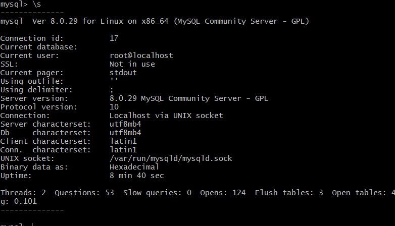
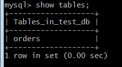
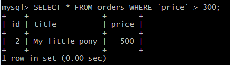
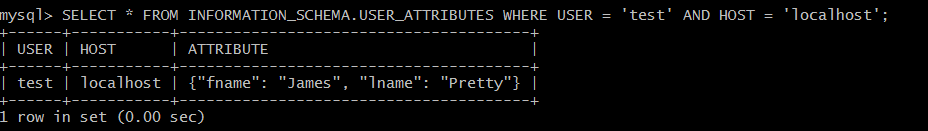
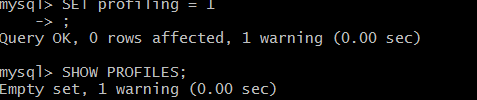
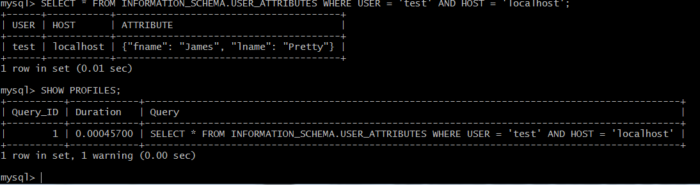
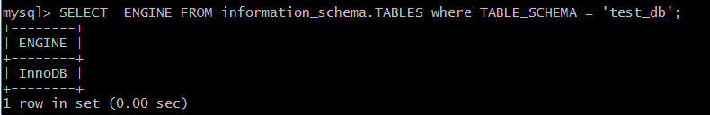
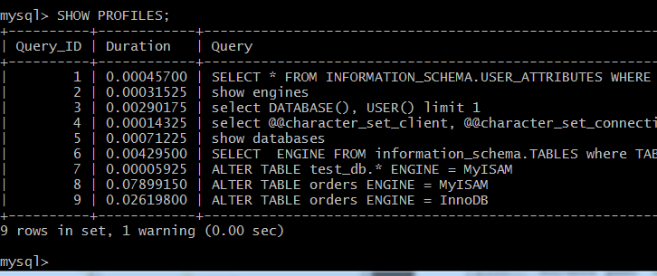

# Домашнее задание к занятию "6.3. MySQL"

## Введение

Перед выполнением задания вы можете ознакомиться с 
[дополнительными материалами](https://github.com/netology-code/virt-homeworks/tree/master/additional/README.md).

## Задача 1

Используя docker поднимите инстанс MySQL (версию 8). Данные БД сохраните в volume.
```bash
sudo docker pull mysql:8
docker volume create mysql_data
docker run --rm --name korsh-mysql-docker -e MYSQL_ROOT_PASSWORD=korsh -v /home/vagrant/test_data:/home/mysql -d mysql:8
docker exec -it korsh-mysql-docker bash
```
Изучите [бэкап БД](https://github.com/netology-code/virt-homeworks/tree/master/06-db-03-mysql/test_data) и 
восстановитесь из него.
```bash
mysql -p
mysql> CREATE DATABASE test_db ;
mysql> exit
mysql -p test_db  < /home/mysql/test_dump.sql
```
Перейдите в управляющую консоль `mysql` внутри контейнера.

> mysql -p

Используя команду `\h` получите список управляющих команд.

Найдите команду для выдачи статуса БД и **приведите в ответе** из ее вывода версию сервера БД.
```mysql
\s
Server version:         8.0.29 MySQL Community Server - GPL
```


Подключитесь к восстановленной БД и получите список таблиц из этой БД.
```mysql
\u test_db
mysql> show tables;
```



**Приведите в ответе** количество записей с `price` > 300.
```mysql
SELECT * FROM orders WHERE `price` > 300;
+----+----------------+-------+
| id | title          | price |
+----+----------------+-------+
|  2 | My little pony |   500 |
+----+----------------+-------+
1 row in set (0.00 sec)
```


В следующих заданиях мы будем продолжать работу с данным контейнером.

## Задача 2

Создайте пользователя test в БД c паролем test-pass, используя:
- плагин авторизации mysql_native_password
- срок истечения пароля - 180 дней 
- количество попыток авторизации - 3 
- максимальное количество запросов в час - 100
- аттрибуты пользователя:
    - Фамилия "Pretty"
    - Имя "James"
```mysql
CREATE USER 'test'@'localhost' IDENTIFIED WITH mysql_native_password BY 'test-pass' WITH MAX_QUERIES_PER_HOUR 100 PASSWORD EXPIRE INTERVAL 180 DAY FAILED_LOGIN_ATTEMPTS 3 ATTRIBUTE '{"fname": "James", "lname": "Pretty"}'; 
```

Предоставьте привилегии пользователю `test` на операции SELECT базы `test_db`.
```mysql
GRANT SELECT ON test_db.*  TO 'test'@'localhost';
``` 

Используя таблицу INFORMATION_SCHEMA.USER_ATTRIBUTES получите данные по пользователю `test` и 
**приведите в ответе к задаче**.
```mysql
SELECT * FROM INFORMATION_SCHEMA.USER_ATTRIBUTES WHERE USER = 'test' AND HOST = 'localhost';
```


## Задача 3

Установите профилирование `SET profiling = 1`.
> включает запись информации об испольуемых ресурсах при выполнении запросов

Изучите вывод профилирования команд `SHOW PROFILES;`.
> сначала пустой, после запроса появляются записи



Исследуйте, какой `engine` используется в таблице БД `test_db` и **приведите в ответе**.
```mysql
SHOW  ENGINES; 
SELECT  ENGINE FROM information_schema.TABLES where TABLE_SCHEMA = 'test_db';
```


Измените `engine` и **приведите время выполнения и запрос на изменения из профайлера в ответе**:
- на `MyISAM`
> mysql> ALTER TABLE orders ENGINE = MyISAM;

- на `InnoDB`
```mysql
ALTER TABLE orders ENGINE = InnoDB;
mysql> SHOW PROFILES;
```



## Задача 4 

Изучите файл `my.cnf` в директории /etc/mysql.

Измените его согласно ТЗ (движок InnoDB):
- Скорость IO важнее сохранности данных
+- Нужна компрессия таблиц для экономии места на диске
+- Размер буффера с незакомиченными транзакциями 1 Мб
+- Буффер кеширования 30% от ОЗУ
+- Размер файла логов операций 100 Мб

Приведите в ответе измененный файл `my.cnf`.
```
[mysqld]
pid-file        = /var/run/mysqld/mysqld.pid
socket          = /var/run/mysqld/mysqld.sock
datadir         = /var/lib/mysql
secure-file-priv= NULL
##добавил следующие строки 
#движок InnoDB
default_storage_engine  = InnoDB
#Скорость IO важнее сохранности данных
innodb_flush_log_at_trx_commit = 2
#Нужна компрессия таблиц для экономии места на диске
have_compress           = YES  
#Размер буффера с незакомиченными транзакциями 1 Мб
innodb_log_buffer_size  = 1048576
# Буффер кеширования 30% от ОЗУ,  cat /proc/meminfo - MemTotal:1004808 kB -> 0.3*1024*1004808
innodb_buffer_pool_size = 308677018
# Размер файла логов операций 100 Мб
innodb_log_file_size    = 104857600
```
---

### Как оформить ДЗ?

Выполненное домашнее задание пришлите ссылкой на .md-файл в вашем репозитории.

---
