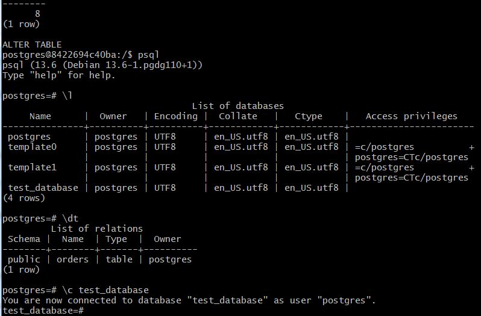
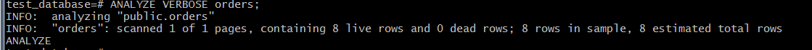
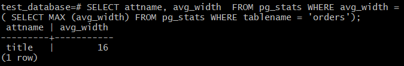

# Домашнее задание к занятию "6.4. PostgreSQL"

## Задача 1

Используя docker поднимите инстанс PostgreSQL (версию 13). Данные БД сохраните в volume.
```bash
vagrant@server1:~$ sudo docker pull postgres:13
docker run --rm --name korsh-pg-docker -e POSTGRES_PASSWORD=korsh -v /home/vagrant/pg_volume:/home/postgresql/data -d postgres:13
```

Подключитесь к БД PostgreSQL используя `psql`.
```bash
docker exec -it korsh-pg-docker bash
su postgres
psql
```


Воспользуйтесь командой `\?` для вывода подсказки по имеющимся в `psql` управляющим командам.

**Найдите и приведите** управляющие команды для:
- вывода списка БД
> \l
- подключения к БД
> \c <имя_БД>
- вывода списка таблиц
> \dt
- вывода описания содержимого таблиц
> \d+ <имя_таблицы>
- выхода из psql
> \q


## Задача 2

Используя `psql` создайте БД `test_database`.
> CREATE DATABASE "test_database";
Изучите [бэкап БД](https://github.com/netology-code/virt-homeworks/tree/master/06-db-04-postgresql/test_data).

Восстановите бэкап БД в `test_database`.

> :/$ psql -d test_database  < /home/postgresql/data/test_dump.sql

Перейдите в управляющую консоль `psql` внутри контейнера.
> psql 

Подключитесь к восстановленной БД и проведите операцию ANALYZE для сбора статистики по таблице.
```
\c test_database
test_database=# ANALYZE VERBOSE orders;
```


Используя таблицу [pg_stats](https://postgrespro.ru/docs/postgresql/12/view-pg-stats), найдите столбец таблицы `orders` 
с наибольшим средним значением размера элементов в байтах.
**Приведите в ответе** команду, которую вы использовали для вычисления и полученный результат.

```SQL
SELECT attname, avg_width  FROM pg_stats WHERE avg_width = ( SELECT MAX (avg_width) FROM pg_stats WHERE tablename = 'orders');
/* ошибочный вариант: SELECT attname, MAX(avg_width) FROM pg_stats WHERE tablename = 'orders' */
```


## Задача 3

Архитектор и администратор БД выяснили, что ваша таблица orders разрослась до невиданных размеров и
поиск по ней занимает долгое время. Вам, как успешному выпускнику курсов DevOps в нетологии предложили
провести разбиение таблицы на 2 (шардировать на orders_1 - price>499 и orders_2 - price<=499).

Предложите SQL-транзакцию для проведения данной операции.
```SQL
-- создаем две 2 таблицы с проверками
CREATE TABLE orders_1 ( CHECK (price > 499) ) INHERITS (orders);
CREATE TABLE orders_2 ( CHECK (price <= 499) ) INHERITS (orders);
-- наполняем значениями, если попытаемся вставлять без услвоия, то будут ошибки
INSERT INTO orders_1 SELECT * FROM orders WHERE	price >  499;
INSERT INTO orders_2 SELECT * FROM orders WHERE	price <= 499;
```
Можно ли было изначально исключить "ручное" разбиение при проектировании таблицы orders?
```SQL
--создавать таблицу как секционированную: 
CREATE TABLE orders (
    id integer NOT NULL,
    title character varying(80) NOT NULL,
    price integer DEFAULT 0
) PARTITION BY RANGE (price);

CREATE TABLE orders_1 PARTITION OF orders FOR VALUES FROM (MINVALUE) TO (499);
CREATE TABLE orders_2 PARTITION OF orders FOR VALUES FROM (499) TO (MAXVALUE);
-- когда границы неизвестны нужно писать MAXVALUE и MINVALUE
```
## Задача 4

Используя утилиту `pg_dump` создайте бекап БД `test_database`.

> pg_dump -U postgres test_database > /home/postgresql/data/test_database-backup.sql

Как бы вы доработали бэкап-файл, чтобы добавить уникальность значения столбца `title` для таблиц `test_database`?
```SQL
-- добавить contraint unique
CREATE TABLE public.orders (
    id integer NOT NULL,
    title character varying(80) UNIQUE NOT NULL,
    price integer DEFAULT 0
);
```

---

### Как cдавать задание

Выполненное домашнее задание пришлите ссылкой на .md-файл в вашем репозитории.

---
