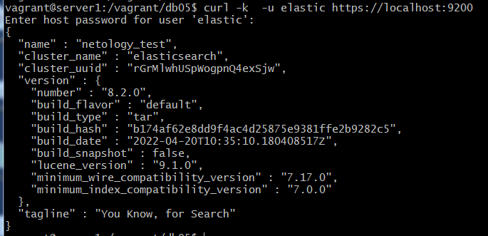
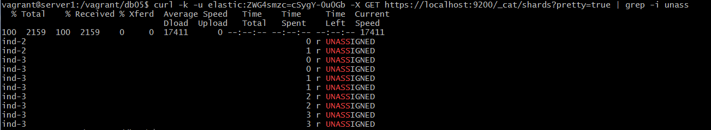
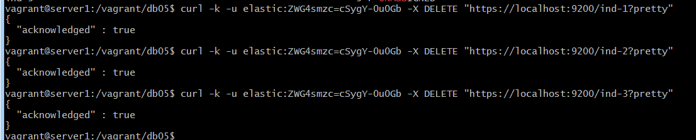
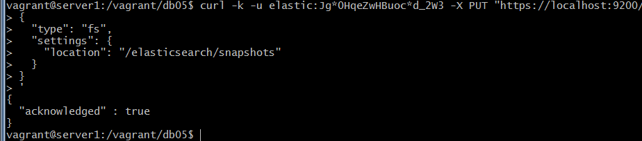
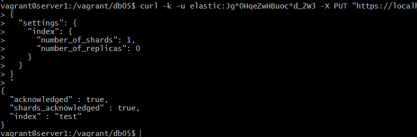
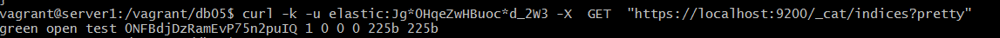
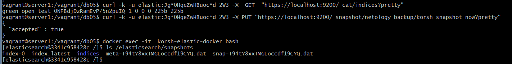
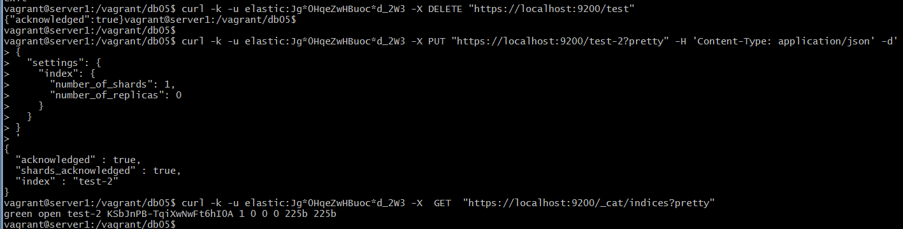
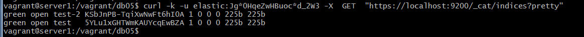

# Домашнее задание к занятию "6.5. Elasticsearch"

## Задача 1

В этом задании вы потренируетесь в:
- установке elasticsearch
- первоначальном конфигурировании elastcisearch
- запуске elasticsearch в docker

Используя докер образ [centos:7](https://hub.docker.com/_/centos) как базовый и 
[документацию по установке и запуску Elastcisearch](https://www.elastic.co/guide/en/elasticsearch/reference/current/targz.html):

> sudo docker pull centos:7

- составьте Dockerfile-манифест для elasticsearch
```Dockerfile
FROM centos:7

ENV ES_PKG_NAME elasticsearch-8.2.0
ENV ES_HOME elasticsearch
# были ошибки java при запуске, добавим перменную
ENV JAVA_HOME /${ES_HOME}/jdk/
# добавляем в path чтобы не писать полные пути
ENV PATH=/usr/lib:/usr/lib/jvm/jre-11/bin:/${ES_HOME}/bin:$PATH

# elastic доступен только через vpn, чтобы не качать каждый раз дистрибутив при отладке Dockerfile скачал и подгружаю дистибутив с локального диска
#copy вместо add, так как add автоматически распаковывает tar
COPY ${ES_PKG_NAME}-linux-x86_64.tar.gz /home
ADD  ${ES_PKG_NAME}-linux-x86_64.tar.gz.sha512   /home/

# ставим пакеты
RUN yum install -y java-11-openjdk wget curl perl-Digest-SHA
RUN cd /home && \
 shasum -a 512 -c ${ES_PKG_NAME}-linux-x86_64.tar.gz.sha512 && \
 tar -xzf ${ES_PKG_NAME}-linux-x86_64.tar.gz && \
 mv $ES_PKG_NAME /${ES_HOME}

# elastic ругался на запуск из под root - создаем и добавляем пользователя, согласно заданию добавим пути в /var/lib
RUN groupadd elasticsearch && useradd -g elasticsearch elasticsearch
RUN chown -R elasticsearch:elasticsearch /${ES_HOME}
RUN mkdir /var/lib/elastic-logs && \
    chown elasticsearch:elasticsearch /var/lib/elastic-logs 
RUN mkdir /var/lib/elastic-data && \
    chown elasticsearch:elasticsearch /var/lib/elastic-data

# загружаем elasticsearch.yml с хоста
ADD elasticsearch.yml /${ES_HOME}/config/elasticsearch.yml

#переключаемся на пользователя и запускаем elasticsearch
USER elasticsearch
CMD ["elasticsearch"]
```

elasticsearch.yml: 
```YAML
# ------------------------------------ Node ------------------------------------
node.name: netology_test	        # Имя ноды
node.roles: [ master, data ]  # Роли узла
#
# ---------------------------------- Network -----------------------------------
network.host: 0.0.0.0	# Адрес узла
http.port: 9200					# Порт
# ----------------------------------- Paths ------------------------------------
path.data: /var/lib/elastic-data  # Директория с данными
path.logs: /var/lib/elastic-logs  # Директория с логами
path.repo: /elasticsearch/snapshots # для последнего ДЗ

```

- соберите docker-образ и сделайте `push` в ваш docker.io репозиторий
- запустите контейнер из получившегося образа и выполните запрос пути `/` c хост-машины
```bash
docker build --rm -t korsh84/elastic_kor:8.2 .
#удаление всех контейнеров docker rm -f $(docker ps -a -q)
# elastic ругается на низкое значение этого параметра при запуске в docker
sysctl -w vm.max_map_count=262144
docker run --rm --name korsh-elastic-docker -p 9200:9200  -d korsh84/elastic_kor:8.2 
# переход в контейнер
docker exec -it  korsh-elastic-docker bash
#в контейнере получаем пароль
docker> elasticsearch-reset-password -u elastic
Password for the [elastic] user successfully reset.
New value: ZWG4smzc=cSygY-0u0Gb
docker> exit
# ключ -k для игнора ошибок сертификатов
curl -k  -u elastic https://localhost:9200
Enter host password for user 'elastic':
{
  "name" : "netology_test",
  "cluster_name" : "elasticsearch",
  "cluster_uuid" : "rGrMlwhUSpWogpnQ4exSjw",
  "version" : {
    "number" : "8.2.0",
    "build_flavor" : "default",
    "build_type" : "tar",
    "build_hash" : "b174af62e8dd9f4ac4d25875e9381ffe2b9282c5",
    "build_date" : "2022-04-20T10:35:10.180408517Z",
    "build_snapshot" : false,
    "lucene_version" : "9.1.0",
    "minimum_wire_compatibility_version" : "7.17.0",
    "minimum_index_compatibility_version" : "7.0.0"
  },
  "tagline" : "You Know, for Search"
}
#подключение без ручного указания пароля
curl -u elastic:ZWG4smzc=cSygY-0u0Gb  "localhost:9200/"
docker push korsh84/elastic_kor:8.2
```

https://hub.docker.com/repository/docker/korsh84/elastic_kor



Требования к `elasticsearch.yml`:
- данные `path` должны сохраняться в `/var/lib`
- имя ноды должно быть `netology_test`

В ответе приведите:
- текст Dockerfile манифеста
- ссылку на образ в репозитории dockerhub
- ответ `elasticsearch` на запрос пути `/` в json виде

Подсказки:
- возможно вам понадобится установка пакета perl-Digest-SHA для корректной работы пакета shasum
- при сетевых проблемах внимательно изучите кластерные и сетевые настройки в elasticsearch.yml
- при некоторых проблемах вам поможет docker директива ulimit
- elasticsearch в логах обычно описывает проблему и пути ее решения

Далее мы будем работать с данным экземпляром elasticsearch.

## Задача 2

В этом задании вы научитесь:
- создавать и удалять индексы
- изучать состояние кластера
- обосновывать причину деградации доступности данных

Ознакомтесь с [документацией](https://www.elastic.co/guide/en/elasticsearch/reference/current/indices-create-index.html) 
и добавьте в `elasticsearch` 3 индекса, в соответствии со таблицей:

| Имя | Количество реплик | Количество шард |
|-----|-------------------|-----------------|
| ind-1| 0 | 1 |
| ind-2 | 1 | 2 |
| ind-3 | 2 | 4 |

```bash
curl -k -u elastic:ZWG4smzc=cSygY-0u0Gb -X PUT "https://localhost:9200/ind-1?pretty" -H 'Content-Type: application/json' -d'
{
  "settings": {
    "index": {
      "number_of_shards": 1,  
      "number_of_replicas": 0 
    }
  }
}
'
curl -k -u elastic:ZWG4smzc=cSygY-0u0Gb -X PUT "https://localhost:9200/ind-2?pretty" -H 'Content-Type: application/json' -d'
{
  "settings": {
    "index": {
      "number_of_shards": 2,  
      "number_of_replicas": 1 
    }
  }
}
'
curl -k -u elastic:ZWG4smzc=cSygY-0u0Gb -X PUT "https://localhost:9200/ind-3?pretty" -H 'Content-Type: application/json' -d'
{
  "settings": {
    "index": {
      "number_of_shards": 4,  
      "number_of_replicas": 2 
    }
  }
}
'
```

- Получите список индексов и их статусов, используя API и **приведите в ответе** на задание.

```bash
curl -k -u elastic:ZWG4smzc=cSygY-0u0Gb -X GET https://localhost:9200/_aliases?pretty=true
{
  "ind-2" : {
    "aliases" : { }
  },
  "ind-1" : {
    "aliases" : { }
  },
  "ind-3" : {
    "aliases" : { }
  },
  ".security-7" : {
    "aliases" : {
      ".security" : {
        "is_hidden" : true
      }
    }
  }
}

curl -k -u elastic:ZWG4smzc=cSygY-0u0Gb -X GET https://localhost:9200/_cat/indices?pretty=true
yellow open ind-2 PGyBduAGSiWAims0pu9Jsg 2 1 0 0 450b 450b
green  open ind-1 hgquEwJ5SvSpxMZrkPs3BQ 1 0 0 0 225b 225b
yellow open ind-3 xw4-H-I7QAC84cstfjDw2Q 4 2 0 0 900b 900b
```

- Получите состояние кластера `elasticsearch`, используя API.

```bash
curl -k -u elastic:ZWG4smzc=cSygY-0u0Gb 'https://127.0.0.1:9200/_cluster/health?pretty=true'
{
  "cluster_name" : "elasticsearch",
  "status" : "yellow",
  "timed_out" : false,
  "number_of_nodes" : 1,
  "number_of_data_nodes" : 1,
  "active_primary_shards" : 11,
  "active_shards" : 11,
  "relocating_shards" : 0,
  "initializing_shards" : 0,
  "unassigned_shards" : 10,
  "delayed_unassigned_shards" : 0,
  "number_of_pending_tasks" : 0,
  "number_of_in_flight_fetch" : 0,
  "task_max_waiting_in_queue_millis" : 0,
  "active_shards_percent_as_number" : 52.38095238095239
}
```

- Как вы думаете, почему часть индексов и кластер находится в состоянии yellow?
	Из документации: 
	"By default, index creation will only return a response to the client when the primary copies of each shard have been started, or the request times out."

	> curl -k -u elastic:ZWG4smzc=cSygY-0u0Gb -XGET https://localhost:9200/_cat/shards?pretty | grep -i unass
	
	
	
	> у нас сервер запущен  на одной ноде на которой размещена первая реплика всех индексов (для ind-1 - единственная), соответственно для ind-2 и ind-3 нужно поднимать дополнительные ноды для размещения реплик
 

- Удалите все индексы.

```bash
curl -k -u elastic:ZWG4smzc=cSygY-0u0Gb -X DELETE "https://localhost:9200/ind-1?pretty"
curl -k -u elastic:ZWG4smzc=cSygY-0u0Gb -X DELETE "https://localhost:9200/ind-2?pretty"
curl -k -u elastic:ZWG4smzc=cSygY-0u0Gb -X DELETE "https://localhost:9200/ind-3?pretty"
```



**Важно**

При проектировании кластера elasticsearch нужно корректно рассчитывать количество реплик и шард,
иначе возможна потеря данных индексов, вплоть до полной, при деградации системы.

## Задача 3

В данном задании вы научитесь:
- создавать бэкапы данных
- восстанавливать индексы из бэкапов

Создайте директорию `{путь до корневой директории с elasticsearch в образе}/snapshots`.
```
docker exec -it  korsh-elastic-docker bash
#в контейнере 
docker> mkdir /elasticsearch/snapshots
```

Используя API [зарегистрируйте](https://www.elastic.co/guide/en/elasticsearch/reference/current/snapshots-register-repository.html#snapshots-register-repository) 
данную директорию как `snapshot repository` c именем `netology_backup`.
**Приведите в ответе** запрос API и результат вызова API для создания репозитория.

```
# пришлось перезапускать elastic из-за правки path.repo - запросил новый пароль
docker exec -it  korsh-elastic-docker bash
#в контейнере получаем пароль
docker> elasticsearch-reset-password -u elastic
Password for the [elastic] user successfully reset.
New value: Jg*0HqeZwHBuoc*d_2W3

curl -k -u elastic:Jg*0HqeZwHBuoc*d_2W3 -X PUT "https://localhost:9200/_snapshot/netology_backup?pretty" -H 'Content-Type: application/json' -d'
{
  "type": "fs",
  "settings": {
    "location": "/elasticsearch/snapshots"
  }
}
'
```



- Создайте индекс `test` с 0 реплик и 1 шардом и **приведите в ответе** список индексов.

```
curl -k -u elastic:Jg*0HqeZwHBuoc*d_2W3 -X PUT "https://localhost:9200/test?pretty" -H 'Content-Type: application/json' -d'
{
  "settings": {
    "index": {
      "number_of_shards": 1,  
      "number_of_replicas": 0 
    }
  }
}
'
curl -k -u elastic:Jg*0HqeZwHBuoc*d_2W3 -X  GET  "https://localhost:9200/_cat/indices?pretty"
```





- [Создайте `snapshot`](https://www.elastic.co/guide/en/elasticsearch/reference/current/snapshots-take-snapshot.html) 
состояния кластера `elasticsearch`.

> curl -k -u elastic:Jg*0HqeZwHBuoc*d_2W3 -X PUT "https://localhost:9200/_snapshot/netology_backup/korsh_snapshot_now?pretty"


**Приведите в ответе** список файлов в директории со `snapshot`ами.

```
[elasticsearch@3341c958428c /]$ ls /elasticsearch/snapshots
index-0  index.latest  indices  meta-T94tY8xxTMGLoccdf19CYQ.dat  snap-T94tY8xxTMGLoccdf19CYQ.dat
[elasticsearch@3341c958428c /]$
```



- Удалите индекс `test` и создайте индекс `test-2`. **Приведите в ответе** список индексов.

```
curl -k -u elastic:Jg*0HqeZwHBuoc*d_2W3 -X DELETE "https://localhost:9200/test"
curl -k -u elastic:Jg*0HqeZwHBuoc*d_2W3 -X PUT "https://localhost:9200/test-2?pretty" -H 'Content-Type: application/json' -d'
{
  "settings": {
    "index": {
      "number_of_shards": 1,  
      "number_of_replicas": 0 
    }
  }
}
'
```



- [Восстановите](https://www.elastic.co/guide/en/elasticsearch/reference/current/snapshots-restore-snapshot.html) состояние
кластера `elasticsearch` из `snapshot`, созданного ранее. 

```
curl -k -u elastic:Jg*0HqeZwHBuoc*d_2W3 -X POST "https://localhost:9200/_snapshot/netology_backup/korsh_snapshot_now/_restore" -H 'Content-Type: application/json' -d'
{
  "indices": "test"
}
'
```

**Приведите в ответе** запрос к API восстановления и итоговый список индексов.



Подсказки:
- возможно вам понадобится доработать `elasticsearch.yml` в части директивы `path.repo` и перезапустить `elasticsearch`

---

### Как cдавать задание

Выполненное домашнее задание пришлите ссылкой на .md-файл в вашем репозитории.

---
