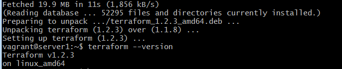

# Домашнее задание к занятию "7.1. Инфраструктура как код"

## Задача 1. Выбор инструментов. 
 
### Легенда
 
Через час совещание на котором менеджер расскажет о новом проекте. Начать работу над которым надо 
будет уже сегодня. 
На данный момент известно, что это будет сервис, который ваша компания будет предоставлять внешним заказчикам.
Первое время, скорее всего, будет один внешний клиент, со временем внешних клиентов станет больше.

Так же по разговорам в компании есть вероятность, что техническое задание еще не четкое, что приведет к большому
количеству небольших релизов, тестирований интеграций, откатов, доработок, то есть скучно не будет.  
   
Вам, как девопс инженеру, будет необходимо принять решение об инструментах для организации инфраструктуры.
На данный момент в вашей компании уже используются следующие инструменты: 
- остатки Сloud Formation, 
- некоторые образы сделаны при помощи Packer,
- год назад начали активно использовать Terraform, 
- разработчики привыкли использовать Docker, 
- уже есть большая база Kubernetes конфигураций, 
- для автоматизации процессов используется Teamcity, 
- также есть совсем немного Ansible скриптов, 
- и ряд bash скриптов для упрощения рутинных задач.  

Для этого в рамках совещания надо будет выяснить подробности о проекте, что бы в итоге определиться с инструментами:


В связи с тем, что проект стартует уже сегодня, в рамках совещания надо будет определиться со всеми этими вопросами.


Если для ответа на эти вопросы недостаточно информации, то напишите какие моменты уточните на совещании.
### В результате задачи необходимо


1. Ответить на четыре вопроса представленных в разделе "Легенда". 

	__Какой тип инфраструктуры будем использовать для этого проекта: изменяемый или не изменяемый?__
	
	> изменяемая инфраструктура, поскольку предполагается активная разработка, а пересборка образов может быть избыточна при минимальных изменений или активного поиска оптимальной конфигурации. Хотя может быть и неизменямая, поскольку исходя из перечня  инструментов  - компании ближе подход с инициализацией ресурсов.
	
	__Будет ли центральный сервер для управления инфраструктурой?__

	> Исходя из перечня инструментов (нет Chef, Puppet, SaltStack) - нет 

	__Будут ли агенты на серверах?__

	> Исходя из перечня инструментов - нет 

	__Будут ли использованы средства для управления конфигурацией или инициализации ресурсов?__

	> для сценария предпочтительна гибридная связка  - инициализация серверов в Terraform + управление конфигурацией через Ansible
 
1. Какие инструменты из уже используемых вы хотели бы использовать для нового проекта? 
	
	Ansible, Terraform, Docker, а от bash хорошо бы избавиться. С развитием проекта - переходить на неизменяемую инфраструктуру: Terraform+packer+docker при масштабировании средства оркестрации 

1. Хотите ли рассмотреть возможность внедрения новых инструментов для этого проекта? 
	
	 будет зависеть от развития проекта и появления новых проектов. Если будет большой проект, то возможен переход на централизованное управление конфигурацией, чтобы снизить нагрузку при изменениях.


## Задача 2. Установка терраформ. 

Официальный сайт: https://www.terraform.io/

Установите терраформ при помощи менеджера пакетов используемого в вашей операционной системе.
В виде результата этой задачи приложите вывод команды `terraform --version`.

> репозитарий hashicorp работает только при включенном vpn

```bash 
curl -fsSL https://apt.releases.hashicorp.com/gpg | sudo apt-key add -
sudo apt-add-repository "deb [arch=amd64] https://apt.releases.hashicorp.com $(lsb_release -cs) main"
sudo apt-get update && sudo apt-get install terraform
```


## Задача 3. Поддержка легаси кода. 

В какой-то момент вы обновили терраформ до новой версии, например с 0.12 до 0.13. 
А код одного из проектов настолько устарел, что не может работать с версией 0.13. 
В связи с этим необходимо сделать так, чтобы вы могли одновременно использовать последнюю версию терраформа установленную при помощи
штатного менеджера пакетов и устаревшую версию 0.12. 

В виде результата этой задачи приложите вывод `--version` двух версий терраформа доступных на вашем компьютере 
или виртуальной машине.

	скачал  бинарники старой версии (1.1.9) с hashicorp

```bash 
vagrant@server1:~$  sudo unzip /vagrant/terraform_1.1.9_linux_amd64.zip -d  /usr/bin/terraform_1.1.9/
vagrant@server1:~$ /usr/bin/terraform_1.1.9/terraform --version
```


---
