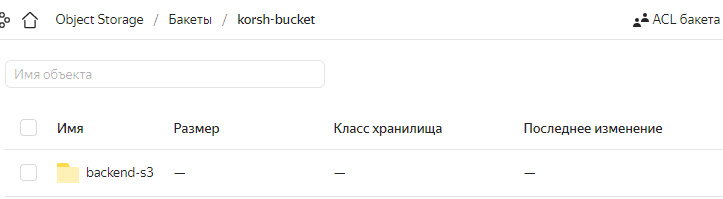
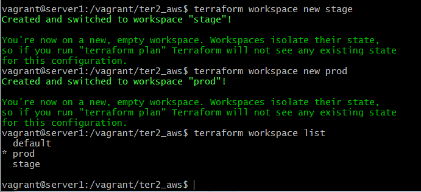
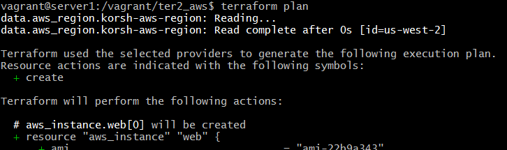
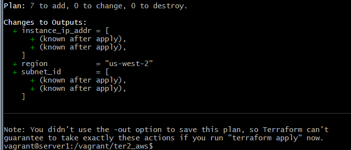

# Домашнее задание к занятию "7.3. Основы и принцип работы Терраформ"

## Задача 1. Создадим бэкэнд в S3 (необязательно, но крайне желательно).

Если в рамках предыдущего задания у вас уже есть аккаунт AWS, то давайте продолжим знакомство со взаимодействием
терраформа и aws.

1. Создайте s3 бакет, iam роль и пользователя от которого будет работать терраформ. Можно создать отдельного пользователя,
а можно использовать созданного в рамках предыдущего задания, просто добавьте ему необходимы права, как описано
[здесь](https://www.terraform.io/docs/backends/types/s3.html).
1. Зарегистрируйте бэкэнд в терраформ проекте как описано по ссылке выше.

> бэкенд я сделал в YС для тренировки, но дальнейшее задание было не очень непонятно как переписать на YC

	1. создать сервисный аккаунт
	```
	vagrant@server1:~$ yc iam service-account create --name korsh-robot
	id: aje2nbg2o6u9b7rkmpar
	folder_id: b1gqao3en7najrn0tpgl
	created_at: "2022-06-16T14:30:23.346449173Z"
	name: korsh-robot
	```

	2. дать роль editor
	`yc resource-manager folder add-access-binding netology --role editor  --subject serviceAccount:aje2nbg2o6u9b7rkmpar`

	3. Создаем ключ доступа
	```
	yc iam access-key create --service-account-name korsh-robot --format json
		{
	"access_key": {
		"id": "aje2iog4f5fdi5sfnki5",
		"service_account_id": "aje2nbg2o6u9b7rkmpar",
		"created_at": "2022-06-16T14:59:00.875416413Z",
		"key_id": "..."
	},
	"secret": ...
	}
	```

	4. Создаем bucket
	```main.tf
	provider "yandex" {
	cloud_id  = "b1g9paqpgfec5bnai2m4"
	folder_id = "b1gqao3en7najrn0tpgl"
	zone      = "ru-central1-a"
	}

	resource "yandex_storage_bucket" "korsh-test" {
	access_key = "..."
	secret_key = "..."
	bucket = "korsh-bucket"
	}

	##versions.tf
	terraform {
	required_providers {
		yandex = {
		source = "yandex-cloud/yandex"
		}
	}
	backend "s3" {
		endpoint   = "storage.yandexcloud.net"
		bucket     = "korsh-bucket"
		region     = "ru-central1-a"
		key        = "backend-s3/terraform.tfstate"
		access_key = ""
		secret_key = ""

		skip_region_validation      = true
		skip_credentials_validation = true
	}
	}
	```
В итоге появилось, но похоже в YC  нужно делать "yandex_compute_instance_group" , а там сильно больше настроек



## Задача 2. Инициализируем проект и создаем воркспейсы.

1. Выполните `terraform init`:
    * если был создан бэкэнд в S3, то терраформ создат файл стейтов в S3 и запись в таблице
dynamodb.
    * иначе будет создан локальный файл со стейтами.  
1. Создайте два воркспейса `stage` и `prod`.

```
terraform workspace new stage
terraform workspace new prod
```

1. В уже созданный `aws_instance` добавьте зависимость типа инстанса от вокспейса, что бы в разных ворскспейсах
использовались разные `instance_type`.

> загрузил в репозитарий файлы tf
```
locals {
   web_instance_type_map = {
   stage = "t3.micro"
   prod = "t3.large"
   }
}
...
instance_type = local.web_instance_type_map[terraform.workspace]
```

1. Добавим `count`. Для `stage` должен создаться один экземпляр `ec2`, а для `prod` два.

```
locals {
   web_instance_count_map = {
       stage = 1
       prod = 2
   }
}
...
count = local.web_instance_count_map[terraform.workspace]
```

1. Создайте рядом еще один `aws_instance`, но теперь определите их количество при помощи `for_each`, а не `count`.

```
resource "aws_instance" "web_each" {
   for_each = local.web_instance_count_map
   ami = "ami-22b9a343"
   #count неодновременно с for_each
```

1. Что бы при изменении типа инстанса не возникло ситуации, когда не будет ни одного инстанса добавьте параметр жизненного цикла `create_before_destroy = true` в один из рессурсов `aws_instance`.

```
 lifecycle {
      create_before_destroy = true
    }
```

1. При желании поэкспериментируйте с другими параметрами и рессурсами.

В виде результата работы пришлите:
* Вывод команды `terraform workspace list`.



* Вывод команды `terraform plan` для воркспейса `prod`.  





https://github.com/korsh84/virt-homeworks/tree/virt-11/07-terraform-03-basic


---

### Как cдавать задание

Выполненное домашнее задание пришлите ссылкой на .md-файл в вашем репозитории.

---
