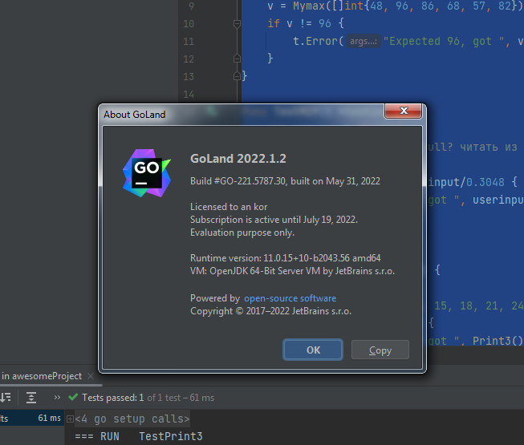
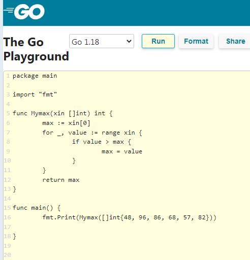
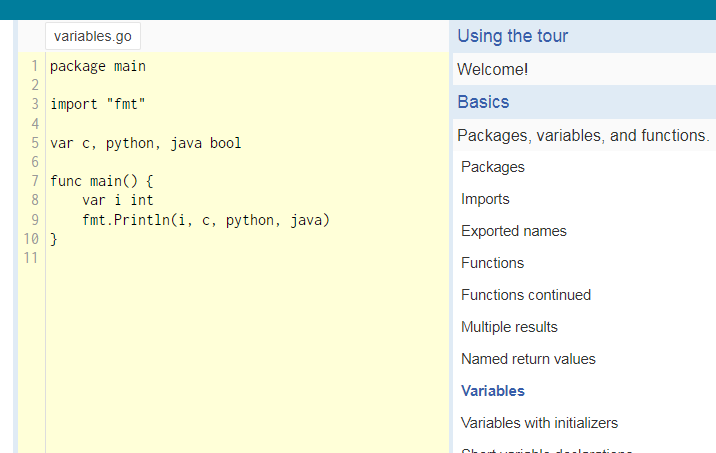

# Домашнее задание к занятию "7.5. Основы golang"

С `golang` в рамках курса, мы будем работать не много, поэтому можно использовать любой IDE.
Но рекомендуем ознакомиться с [GoLand](https://www.jetbrains.com/ru-ru/go/).  

> поставил



## Задача 1. Установите golang.
1. Воспользуйтесь инструкций с официального сайта: [https://golang.org/](https://golang.org/).
2. Так же для тестирования кода можно использовать песочницу: [https://play.golang.org/](https://play.golang.org/).

> примеры позапускал, непонятно как читать с клавиатуры



## Задача 2. Знакомство с gotour.
У Golang есть обучающая интерактивная консоль [https://tour.golang.org/](https://tour.golang.org/).
Рекомендуется изучить максимальное количество примеров. В консоли уже написан необходимый код,
осталось только с ним ознакомиться и поэкспериментировать как написано в инструкции в левой части экрана.  

> примеры позапускал, непонятно как читать с клавиатуры



## Задача 3. Написание кода.
Цель этого задания закрепить знания о базовом синтаксисе языка. Можно использовать редактор кода
на своем компьютере, либо использовать песочницу: [https://play.golang.org/](https://play.golang.org/).

1. Напишите программу для перевода метров в футы (1 фут = 0.3048 метр). Можно запросить исходные данные
у пользователя, а можно статически задать в коде.
    Для взаимодействия с пользователем можно использовать функцию `Scanf`:
    ```go
	package main

	import "fmt"

	func main() {
		fmt.Print("Enter a value in meters: ")
		var input float64
		fmt.Scanf("%f", &input)

		output := input / 0.3048

		fmt.Println("Value in feets:", output)
	}
    ```

1. Напишите программу, которая найдет наименьший элемент в любом заданном списке, например:

    ``x := []int{48, 96, 86, 68, 57, 82, 63, 70, 37, 34, 83, 27, 19, 97, 9, 117}``

```go
package main

import "fmt"

func main() {
	x := []int{48, 96, 86, 68, 57, 82, 63, 70, 37, 34, 83, 27, 19, 97, 9, 17}
	max := x[0]
	for _, value := range x {
		if value > max {
			max = value
		}
	}

	fmt.Print("Max number: ", max)
}
 ```


1. Напишите программу, которая выводит числа от 1 до 100, которые делятся на 3. То есть `(3, 6, 9, …)`.

```go
package main

import "fmt"

func main() {
	for i := 1; i <= 100; i++ {
		if (i % 3) == 0 {
			fmt.Print(i,", ")
		}
	}
}
 ```


В виде решения ссылку на код или сам код.

## Задача 4. Протестировать код (не обязательно).
```go
//переписал на отдельные функции
////max.go
package main

//package math

import (
	"fmt"
	"strconv"
)

func M2f(userinput float64) float64 {
	output := userinput / 0.3048
	//fmt.Println("Value in feets:", output)
	return output
}

func Mymax(xin []int) int {
	max := xin[0]
	for _, value := range xin {
		if value > max {
			max = value
		}
	}
	return max
}

func Print3() string {
	var output string
	for i := 1; i <= 100; i++ {
		if (i % 3) == 0 {
			ip := strconv.Itoa(i)
			output = output + ip + ", "
		}
	}
	//output = output + "1"
	return output
}

func main() {
	fmt.Println(Mymax([]int{48, 96, 86, 68, 57, 82}))
	//
	fmt.Print("Enter a value in meters: ")
	var input float64
	fmt.Scanf("%f", &input)
	fmt.Println("Value in feets:", M2f(input))
	fmt.Print(Print3())
}
/////////
////max_test.go
package main

import (
	"testing"
)

// тесты очень топорные, написал для себя чтоб познакомиться с синтаксисом

func TestMymax(t *testing.T) {
	var v int
	v = Mymax([]int{48, 96, 86, 68, 57, 82})
	if v != 96 {
		t.Error("Expected 96, got ", v)
	}
}

func TestM2f(t *testing.T) {
	var userinput float64
	//для тестов stdin /dev/null, читать из файлов или жестко прописывать
	userinput = 1.5
	if M2f(userinput) != userinput/0.3048 {
		t.Error("Error got ", userinput/0.3048)
	}
}

func TestPrint3(t *testing.T) {
	var userinput string
	userinput = "3, 6, 9, 12, 15, 18, 21, 24, 27, 30, 33, 36, 39, 42, 45, 48, 51, 54, 57, 60, 63, 66, 69, 72, 75, 78, 81, 84, 87, 90, 93, 96, 99, "
	if Print3() != userinput {
		t.Error("Error got ", Print3())
	}
}
```


---

### Как cдавать задание

Выполненное домашнее задание пришлите ссылкой на .md-файл в вашем репозитории.

---
